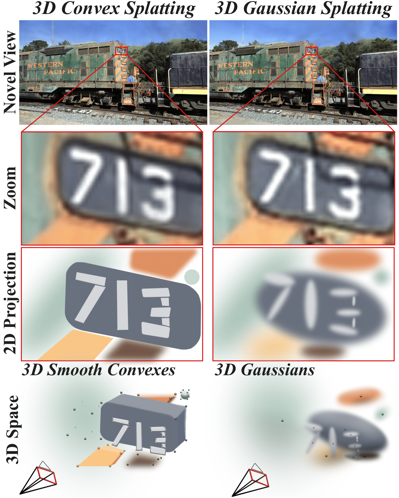

<h1 align="center">3D Convex Splatting: Radiance Field Rendering with 3D Smooth Convexes</h1>

<div align="center">
  <a href="https://convexsplatting.github.io/">Project page</a> &nbsp;|&nbsp;
  <a href="https://arxiv.org/abs/2411.14974">Arxiv</a> &nbsp;|&nbsp;
  <a href="https://www.youtube.com/watch?v=5N3OFHH7lbU&t=2s">Youtube</a>
</div>
<br>

<p align="center">
  Jan Held*, Renaud Vandeghen*, Abdullah Hamdi*, Adrien Deliege, Anthony Cioppa, Silvio Giancola, Andrea Vedaldi, Bernard Ghanem, Marc Van Droogenbroeck
</p>

<br>

<div align="center">
  
</div>

This repo contains the official implementation for the paper "3D Convex Splatting: Radiance Field Rendering with 3D Smooth Convexes". 
Our work represents a significant advancement in radiance field rendering by introducing 3D smooth convex primitives, which offer an efficient, geometrically meaningful, and flexible approach to scene representation and synthesis.


## BibTeX
```bibtex
@article{held20243d,
  title={3D Convex Splatting: Radiance Field Rendering with 3D Smooth Convexes},
  author={Held, Jan and Vandeghen, Renaud and Hamdi, Abdullah and Deliege, Adrien and Cioppa, Anthony and Giancola, Silvio and Vedaldi, Andrea and Ghanem, Bernard and Van Droogenbroeck, Marc},
  journal={arXiv preprint arXiv:2411.14974},
  year={2024}
}
```

## Cloning the Repository + Installation

The code has been used and tested with Python 3.11 and CUDA 12.6.

You should clone the repository with the different submodules by running the following command:

```bash
git clone https://github.com/convexsplatting/convex-splatting --recursive
```

Then, we suggest to use a virtual environment to install the dependencies.

```bash
micromamba create -f requirements.yaml
```

Finally, you can compile the custom CUDA kernels by running the following command:

```bash
bash compile.sh
cd submodules/simple-knn
pip install .
```

## Training
To train our model, you can use the following command:
```bash
python train.py -s <path_to_scenes> -m <output_model_path>
```

If you want to train the model on outdoor scenes, you should add the following command:  
```bash
python train.py -s <path_to_scenes> -m <output_model_path> --outdoor
```

If you want to train our light model, you should add the following command:  
```bash
python train.py -s <path_to_scenes> -m <output_model_path> --light
```

## Rendering
To render a scene, you can use the following command:
```bash
python render.py -m <path_to_model>
```

## Evaluation
To evaluate the model, you can use the following command:
```bash
python metrics.py -m <path_to_model>
```

## Video
To render a video, you can use the following command:
```bash
python create_video.py -m <path_to_model>
```

## Replication of the results
To replicate the results of our paper, you can use the following command:
```bash
python full_eval.py --output_path <output_path> -m360 <path_to_MipNeRF360> -tat <path_to_T&T> -db <path_to_DB>
```


## Acknowledgements

This project is built upon [3DGS](https://github.com/graphdeco-inria/gaussian-splatting) and [CvxNet](https://github.com/tensorflow/graphics/tree/master/tensorflow_graphics/projects/cvxnet). 
We want to thank the authors for their contributions.


J. Held and A. Cioppa are funded by the F.R.S.-FNRS. The research reported in this publication was supported by funding from KAUST Center of Excellence on GenAI, under award number 5940. This work was also supported by KAUST Ibn Rushd Postdoc Fellowship program. The present research benefited from computational resources made available on Lucia, the Tier-1 supercomputer of the Walloon Region, infrastructure funded by the Walloon Region under the grant agreement n°1910247.

<div align="center">


</div>

## Contact Information
For more information or questions, please contact: jan.held@uliege.be
